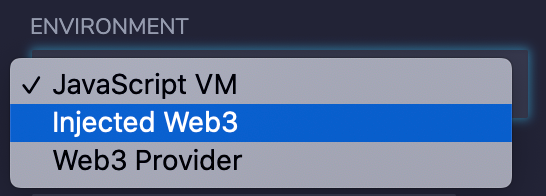

# 리믹스(Remix) 연동 

## 리믹스(Remix)란? 

Solidity Contract 개발을 위한 브라우저 기반의 IDE 입니다. Klaytn은 Solidity Contract를 지원하고 있으며, EVM 버전을 Constantinople로 설정 시 호환 가능합니다. 이 문서는 Remix와 Klaytn의 연동에 대해서만 다루고 있습니다. 자세한 사용법은 [ **Remix docs**](https://remix-ide.readthedocs.io/en/latest/) 혹은 Remix에서 파생된 [**Klaytn IDE**](../../smart-contract/ide-and-tools/README.md#klaytn-ide) 사용법을 참고하시기 바랍니다.

## Remix Solidity Compiler 설정 

* Click on the Solidity Compiler tab.

* Set EVM Version to Constantinople. **Reference:** [Porting Ethereum Contract](https://docs.klaytn.com/smart-contract/porting-ethereum-contract#solidity-support)

## Remix Deploy 환경 설정 

* Click on the [Deploy & Run Transactions] tab.
* Select the appropriate [Environment].

  * **[JavaScript VM]**: Connects to an inbuilt test network within Remix
  * **[Injected Web3]**: Connects to network through Mist browser or MetaMask
  * **[Web3 Provider]**: Connects directly to Klaytn node, which supports RPC

## Case 1. EN(Endpoint Node)을 이용한 Klaytn - Remix 연동 

* Set up an Endpoint Node in the local environment by following the instructions in [**the EN documents**](https://docs.klaytn.com/getting-started/quick-start/launch-an-en).

* Create an account by following the instructions in [**Account Management**](https://docs.klaytn.com/getting-started/account).

  > **Note:** If you use the Public EN from Baobab, instead of from your local environment, you won't be connected to your account because the personal API is disabled.

* Select [Web3 Provider] in the Remix Environment menu.

* Enter the RPC address of the EN in the Web3 Provider Endpoint. Local EN (default): [http://localhost:8551](http://localhost:8551/)

* Once you are successfully connected to the Network, you will see the Chain ID as below. You can view the list of accounts that you have created in Account.

## Case 2. 메타마스크(MetaMask)를 이용한 Klaytn - Remix 연동 

* Connect Klaytn with MetaMask by referring to the [**Connecting to MetaMask**](https://groundx.atlassian.net/wiki/spaces/~59728130/pages/1880752196/Klaytn+Docs+-+Metamast+Remix).
* Select [Injected Web3] on the Remix Environment menu.

* When you see the MetaMask pop-up, select the connected account and click [Next].
* Once you are connected to the Network (Baobab Testnet in this example), you will see the Chain ID as below. You can check the connection status with the MetaMask wallet under [Account].

## Remix 연동 사용 예제 

We will be using the [**KlaytnGreeter**](https://docs.klaytn.com/smart-contract/sample-contracts/klaytngreeter) sample contract.

* Add KlaytnGreeter.sol and write the testing code.

* On the Solidity Compile tab, select [Compile KlaytnGreeter.sol] to compile the contract code.
* In the Deploy & Run Transactions tab, click [Deploy] to deploy the compiled contract.

* You can view the deployed contract. You can test or debug it.

