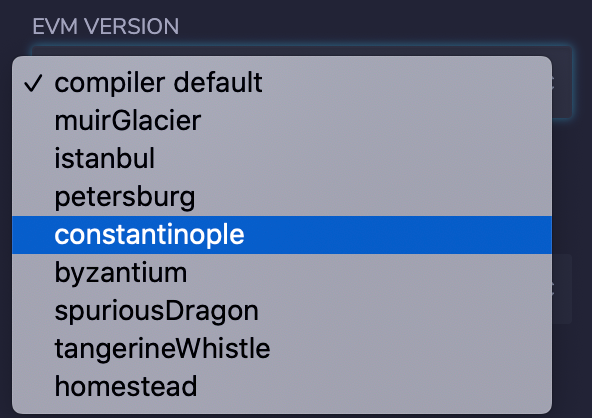
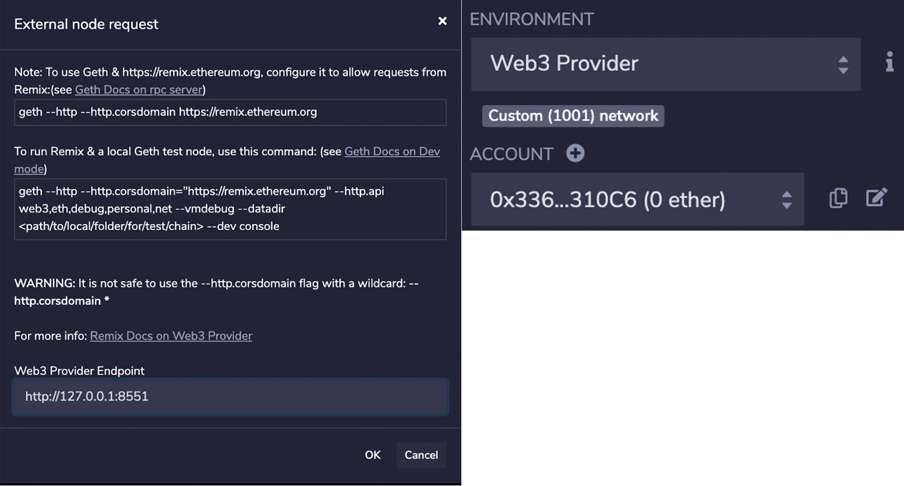

# Connecting Remix 

## What is Remix 

Remix is a browser-based IDE (Integrated Development Environment) for developing Solidity contracts. Klaytn supports Solidity contracts, and is compatible with the Constantinople version of EVM. This document will cover connecting Remix with Klaytn. If you want to know more about how to use Remix, please refer to[ **Remix docs**](https://remix-ide.readthedocs.io/en/latest/) or [**Klaytn IDE**](../../smart-contract/ide-and-tools/README.md#klaytn-ide), which was derived from Remix.

## Setting Remix Solidity Compiler 

* Click on the Solidity Compiler tab. 
* Set EVM Version to Constantinople. **Reference:** [Porting Ethereum Contract](https://docs.klaytn.com/smart-contract/porting-ethereum-contract#solidity-support) 

## Setting up the Remix Deploy Environment 

* Click on the [Deploy & Run Transactions] tab.
* Select the appropriate [Environment]. 
  * **[JavaScript VM]**: Connects to an inbuilt test network within Remix
  * **[Injected Web3]**: Connects to network through Mist browser or MetaMask
  * **[Web3 Provider]**: Connects directly to Klaytn node, which supports RPC

## Case 1. Connecting Klaytn - Remix using EN (Endpoint Node) 

* Set up an Endpoint Node in the local environment by following the instructions in [**the EN documents**](https://docs.klaytn.com/getting-started/quick-start/launch-an-en).

* Create an account by following the instructions in [**Account Management**](https://docs.klaytn.com/getting-started/account).

  > **Note:** If you use the Public EN from Baobab, instead of from your local environment, you won't be connected to your account because the personal API is disabled.

* Select [Web3 Provider] in the Remix Environment menu. 

* Enter the RPC address of the EN in the Web3 Provider Endpoint. Local EN (default): [http://localhost:8551](http://localhost:8551/)

* Once you are successfully connected to the Network, you will see the Chain ID as below. You can view the list of accounts that you have created in Account. 

## Case 2. Connecting Klaytn - Remix using MetaMask 

* Connect Klaytn with MetaMask by referring to the [**Connecting to MetaMask**](https://groundx.atlassian.net/wiki/spaces/~59728130/pages/1880752196/Klaytn+Docs+-+Metamast+Remix).
* Select [Injected Web3] on the Remix Environment menu. 

* When you see the MetaMask pop-up, select the connected account and click [Next].
* Once you are connected to the Network (Baobab Testnet in this example), you will see the Chain ID as below. You can check the connection status with the MetaMask wallet under [Account]. 

## Tutorial: Connecting Remix 

We will be using the [**KlaytnGreeter**](https://docs.klaytn.com/smart-contract/sample-contracts/klaytngreeter) sample contract.

* Add KlaytnGreeter.sol and write the testing code. 
* On the Solidity Compile tab, select [Compile KlaytnGreeter.sol] to compile the contract code.
* In the Deploy & Run Transactions tab, click [Deploy] to deploy the compiled contract. 
* You can view the deployed contract. You can test or debug it. 
