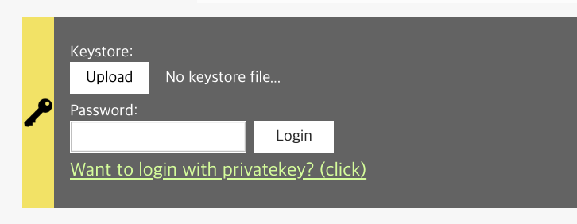

# 5-2. Auth 컴포넌트

`src/components/Auth.js`:

## `Auth` 컴포넌트

1\) 배경지식 2\) `Auth` 컴포넌트 개요 3\) `Auth` 컴포넌트의 기능: 사용자가 개인키를 입력하여 로그인 4\) `Auth` 컴포넌트 기능: 사용자가 키스토어 파일을 가져온 후 비밀번호를 입력하여 로그인 5\) `Auth` 컴포넌트 기능: 사용자 로그아웃 후 브라우저에서 지갑 인스턴스 정보를 삭제

### 1\) 배경지식

블록체인 기반의 어플리케이션에서는 일반적으로 스마트 컨트랙트와 상호작용합니다. 스마트 컨트랙트와 상호작용하는 데에는 두 가지 유형이 있습니다. `1) 컨트랙트로부터 데이터를 읽어오거나, ` `2) 컨트랙트에 데이터를 쓰는 것입니다.`

컨트랙트로부터 데이터를 읽어오는 데에는 비용이 들지 않습니다. 반면 컨트랙트에 데이터를 쓰는 데에는 비용이 듭니다.

참고\) `트랜잭션 전송하기` 컨트랙트 또는 블록체인에 데이터를 쓰는 것은 '트랜잭션을 전송한다'라고 할 수 있습니다. 예를 들어 친구에게 5 KLAY를 보낸다는 것은 즉, `친구에게 5 KLAY를 전송하였다는 데이터를 블록체인에 쓴다`와 같은 것입니다. 컨트랙트 메서드를 호출하는 것도 이와 동일합니다. 즉 `변수 X를 100으로 설정하겠다는 데이터를 스마트 컨트랙트에 쓴다`고 볼 수 있습니다. 이처럼 블록체인이나 스마트 컨트랙트에 데이터를 쓰는 것과 관련된 모든 것은 `트랜잭션 보내기`랍니다.

컨트랙트에 데이터를 쓰려면 트랜잭션 비용을 지급할 수 있을 만큼의 KLAY를 갖고 있는 Klaytn 계정이 필요합니다. 이때 `Auth` 컴포넌트는 어플리케이션에 로그인할 수 있도록 해주는 역할을 합니다.

### 2\) `Auth` 컴포넌트 개요

`'Auth.js'` 컴포넌트는 본 튜토리얼의 어플리케이션에서 가장 긴 코드입니다. 그러므로 코드를 세분화하여 하나씩 살펴보도록 할게요.

이 컴포넌트는 다음과 같은 사용자 인터페이스를 제공합니다. 

주요 기능은 다음과 같습니다. 1\) 사용자는 개인키를 입력하여 로그인할 수 있습니다. 2\) 사용자는 키스토어 파일을 가져온 후 비밀번호를 입력하여 로그인할 수 있습니다. 3\) 사용자가 로그아웃하면 브라우저에서 지갑 인스턴스 정보를 삭제할 수 있습니다.

### 3\) `Auth` 컴포넌트 기능: 사용자가 개인키를 입력하여 로그인

개인키로 로그인하려면 `integrateWallet` 메서드가 필요합니다.

```javascript
integrateWallet = (privateKey) => {
  const walletInstance = cav.klay.accounts.privateKeyToAccount(privateKey)
  cav.klay.accounts.wallet.add(walletInstance)
  sessionStorage.setItem('walletInstance', JSON.stringify(walletInstance))
  this.reset()
}
```

`integateWallet` 함수는 `privateKey`를 인자로 받아서 지갑 인스턴스를 생성합니다.

Line 1: `const walletInstance = cav.klay.accounts.privateKeyToAccount(privateKey)` `privateKeyToAccount` API로 생성한 지갑 인스턴스를 `walletInstance` 변수에 저장합니다.

Line 2: `cav.klay.accounts.wallet.add(walletInstance)` 트랜잭션을 보내려면 `cav.klay.accounts.wallet.add(walletInstance)`를 통해 지갑 인스턴스를 caver에 추가해야 합니다.

Line 3: `sessionStorage.setItem('walletInstance', JSON.stringify(walletInstance))` `sessionStorage.setItem`는 브라우저의 세션 스토리지에 값을 저장하는 데에 사용하는 브라우저 API입니다. 튜토리얼 어플리케이션 페이지를 새로 고쳐도 사용자의 로그인 상태를 유지하기 위해 지갑 인스턴스를 JSON 문자열로 세션 스토리지에 저장하는 과정입니다.

참고\) 브라우저 탭을 닫으면 세션 저장소에 저장된 항목들이 사라집니다.

Line 4: `this.reset()` 현재 컴포넌트의 상태를 초기화하여 입력을 지웁니다.

caver-js의 `privateKeyToAccount` API에 대한 자세한 안내는 [caver.klay.accounts.privateKeyToAccount](../../../sdk/caver-js/api-references/caver.klay.accounts.md#privatekeytoaccount)를 참고해주세요.

### 4\) `Auth` 컴포넌트 기능: 사용자가 키스토어 파일을 가져온 후 비밀번호를 입력하여 로그인

키스토어와 비밀번호로 로그인하려면 `handleImport`와 `handleLogin` 메서드가 필요합니다.

```javascript
/**
 * handleImport method takes a file, read
 */
handleImport = (e) => {
  const keystore = e.target.files[0]
  // 'FileReader'는 파일의 내용을 읽어오는 데에 사용됩니다.
  // 'onload' 핸들러와 'readAsText' 메서드를 사용할 것입니다.
  // * FileReader.onload
  // - 이 이벤트는 읽기 작업이 완료될 때마다 발생합니다.
  // * FileReader.readAsText()
  // - 내용을 읽어오기 시작합니다.
  const fileReader = new FileReader()
  fileReader.onload = (e) => {
    try {
      if (!this.checkValidKeystore(e.target.result)) {
        // 키스토어 파일이 유효하지 않으면 "Invalid keystore file." 메세지를 띄웁니다.
        this.setState({ keystoreMsg: 'Invalid keystore file.' })
        return
      }

      // 키스토어 파일이 유효하다면
      // 1) e.target.result를 키스토어로 지정합니다.
      // 2) "It is valid keystore. input your password." 메세지를 띄웁니다.
      this.setState({
        keystore: e.target.result,
        keystoreMsg: 'It is valid keystore. input your password.',
      }, () => document.querySelector('#input-password').focus())
    } catch (e) {
      this.setState({ keystoreMsg: 'Invalid keystore file.' })
      return
    }
  }
  fileReader.readAsText(keystore)
}
```

`FileReader` 브라우저 API를 사용하여 사용자로부터 파일을 가져오세요. `e.target.files[0]`은 파일의 메타 정보를 담고 있습니다. 해당 파일의 내용을 읽어오려면 `fileReader.readAsText(keystore)` API를 호출하세요. `fileReader.readAsText(keystore)`를 호출하면, `fileReader.onload` 함수는 읽어온 파일의 내용을 `e.target.result` 파일로 출력합니다. 키스토어 파일을 가져오면 비밀번호 입력을 받습니다.

참고\) 키스토어는 암호화된 개인키를 담고 있습니다. 키스토어를 복호화하여 실제 개인키를 얻으려면 비밀번호를 입력해야 합니다. _경고! 키스토어 파일을 다른 사람에게 노출하지 마세요._

`<input>` 부분에 비밀번호를 입력하세요. 입력된 값은 `handleChange` 메서드를 통해 `password`에 저장됩니다.

```markup
<input
  id="input-password"
  className="Auth__passwordInput"
  name="password"
  type="password"
  onChange={this.handleChange}
/>
```

키스토어 파일과 비밀번호가 모두 준비되었네요. 이제 `cav.klay.accounts.decrypt(keystore, password)` API를 통해 개인키를 얻어 키스토어 파일을 복호화할 수 있습니다. 이 API는 개인키를 포함하는 지갑 인스턴스를 반환합니다. 개인키를 가져오면, 앞서 사용한 방법 그대로 `integrateWallet` 메서드를 사용할 수 있습니다.

```javascript
handleLogin = () => {
  const { accessType, keystore, password, privateKey } = this.state

  // 접근 방법 2: 개인키로 접근
  if (accessType == 'privateKey') {
    this.integrateWallet(privateKey)
    return
  }

  // 접근 방법 1: 키스토어 + 비밀번호로 접근
  try {
    const { privateKey: privateKeyFromKeystore } = cav.klay.accounts.decrypt(keystore, password)
    this.integrateWallet(privateKeyFromKeystore)
  } catch (e) {
    this.setState({ keystoreMsg: `Password doesn't match.` })
  }
}
```

비밀번호를 사용하여 키스토어 파일을 복호화하는 방법에 대한 자세한 안내는 [caver.klay.accounts.decrypt](../../../sdk/caver-js/api-references/caver.klay.accounts.md#decrypt)를 참고해주세요.

### 5\) `Auth` 컴포넌트 기능: 사용자 로그아웃 후 브라우저에서 지갑 인스턴스 정보를 삭제

'로그아웃'은 브라우저와 caver로부터 지갑 인스턴스를 제거하는 것입니다. `cav.klay.accounts.wallet.clear()`는 caver로부터 모든 지갑 인스턴스를 제거합니다. `sessionStorage.removeItem('walletInstance')`는 브라우저의 세션 스토리지로부터 지갑 인스턴스를 제거합니다.

```javascript
/**
 * removeWallet 메서드는 다음 항목들을 제거합니다.
 * 1) caver.klay.accounts의 지갑 인스턴스
 * 2) 세션 저장소의 'walletInstance' 값
 */
removeWallet = () => {
  cav.klay.accounts.wallet.clear()
  sessionStorage.removeItem('walletInstance')
  this.reset()
}
```

caver-js의 지갑 인스턴스를 지우는 방법에 대한 자세한 안내는 [caver.klay.accounts.wallet.clear](../../../sdk/caver-js/api-references/caver.klay.accounts.md#wallet-clear)를 참고해주세요.

