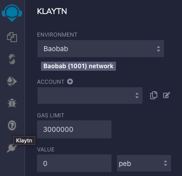
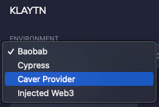
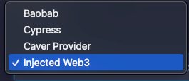
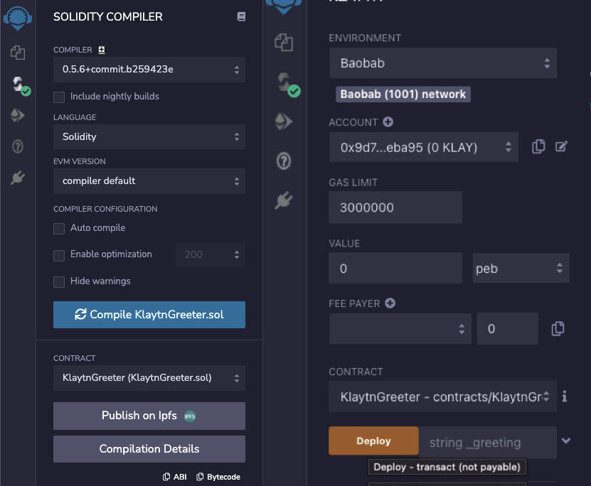

# 리믹스(Remix) 연동 

## 리믹스(Remix)란? 

Solidity Contract 개발을 위한 브라우저 기반의 IDE 입니다. 이 문서는 리믹스와 클레이튼의 연동에 대해서만 다루고 있습니다. 리믹스에 대한 자세한 사용법은 [ **Remix docs**](https://remix-ide.readthedocs.io/en/latest/) 혹은 리믹스에서 파생된 [**Klaytn IDE**](../../smart-contract/ide-and-tools/README.md#klaytn-ide) 사용법을 참고하시기 바랍니다.

## EVM 버전 설정하기 
클레이튼은 솔리디티로 작성된 컨트랙트를 지원하며, EVM의 **London** 버전과 호환됩니다. 클레이튼은 솔리디티 버전 0.8.x 이하를 지원합니다. 클레이튼에 컨트랙트를 배포하기 위해서는 컨트랙트가  **London** EVM 버전으로 컴파일되어야 합니다.

* **solidity compiler**를 클릭한 후 **London** EVM 버전을 선택해주세요.

## 로컬 플러그인 연동하기 

리믹스를 사용해 클레이튼 네트워크에 연결하기 위해서는 로컬 플러그인이 필요합니다. 그 프로세스는 아래와 같이 설명됩니다.

* **plugin manager**를 클릭한 뒤 **Connect to a Local Plugin**를 클릭하세요.

* **URL**에 https://klaytn-remix-plugin.ozys.net를 입력하세요. **Plugin Name**과 **Display Name**에 원하는 아무 이름이나 사용할 수 있습니다.

* [Klaytn] 탭이 보이면 이제 클레이튼과 연결할 준비가 완료된 것입니다.

## 배포 환경 설정하기

* [Klaytn] 탭을 클릭하세요.
* 적절한 [Environment]을 선택하세요.  **Baobab**, **Cypress** 또는 **Caver Provider** 중에서 선택할 수 있습니다.
  * **[Baobab]**: Baobab 네트워크에 연결합니다.
  * **[Cypress]**: Cypress 네트워크에 연결합니다.
  * **[Caver Provider]**: RPC를 지원하는 클레이튼 노드에 직접 연결합니다.

## 계정 가져오기

* **private key** 나 **Keystore**에서 키를 가져올 수 있습니다.
* **ACCOUNT** 옆 **plus** 버튼을 클릭합니다.

* private key나 keystore를 입력하세요.
* **feePayer**를 위해 키를 가져올 수도 있습니다. **private key**만 지원합니다.

## EN(Endpoint Node)을 이용한 클레이튼 - 리믹스 연동

* Set up an Endpoint Node in the local environment by following the instructions in [**the EN documents**](https://docs.klaytn.foundation/getting-started/quick-start/launch-an-en).

* Create an account by following the instructions in [**Account Management**](https://docs.klaytn.foundation/getting-started/account).

  > **Note:** 개인 환경의 EN이 아닌 Baobab Public EN으로 연결 시 personal API가 닫혀있기 때문에 Account에 연결되지 않습니다.

* 환경 설정에서 [Caver Provider]를 선택합니다.

* Caver Provider Endpoint에 위에서 띄운 EN의 RPC 주소를 입력합니다. Local EN(default): [http://localhost:8551](http://localhost:8551/)

* 네트워크에 연결되면 Chain ID가 아래와 같이 표시됩니다. 앞에서 생성한 계정 목록을 Account에서 확인할 수 있습니다.

## 메타마스크를 사용하여 클레이튼 - 리믹스 연동하기

* Connect Klaytn with MetaMask by referring to the [**Connecting to MetaMask**](https://docs.klaytn.foundation/dapp/tutorials/connecting-metamask).
* Remix 환경 설정에서 [Injected Web3]를 선택합니다.

* 메타마스크에 연결이 뜨면 연동된 Account를 선택 후 [Next]를 클릭합니다.
* Network(예제에서는 Baobab 테스트넷)에 연결되면 Chain ID가 아래와 같이 표시됩니다. MetaMask 지갑과의 연결 상태를 [Account]에서 확인할 수 있습니다.

## 튜토리얼: KlaytnGreeter 컨트랙트 

We will be using the [**KlaytnGreeter**](https://docs.klaytn.foundation/smart-contract/sample-contracts/klaytngreeter) sample contract.

* KlaytnGreeter.sol 파일을 추가하고 테스트할 코드를 작성합니다.

* Solidity Compile 탭에서 [Compile KlaytnGreeter.sol]을 클릭해 작성한 컨트랙트 코드를 컴파일합니다.
* Deploy & Run Transactions 탭에서 [Deploy]를 클릭해 컴파일된 컨트랙트를 배포합니다.

* 배포된 컨트랙트를 확인합니다. 테스트하거나 디버깅할 수 있습니다.

