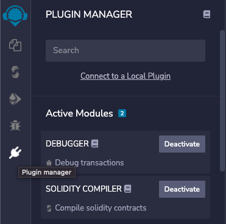
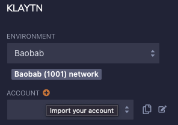

# 리믹스(Remix) 연동하기

## 리믹스(Remix)란? 

Solidity Contract 개발을 위한 브라우저 기반의 IDE 입니다. 이 문서는 리믹스와 클레이튼의 연동에 대해서만 다루고 있습니다. If you want to know more about how to use Remix, please refer to[ **Remix docs**](https://remix-ide.readthedocs.io/en/latest/) or [**Klaytn IDE**](../../smart-contract/ide-and-tools/#klaytn-ide), which was derived from Remix.

> Remix IDE : [https://remix.ethereum.org/](https://remix.ethereum.org/)

## EVM 버전 설정하기 

클레이튼은 솔리디티로 작성된 컨트랙트를 지원하며, EVM의 **London** 버전과 호환됩니다. 클레이튼은 솔리디티 버전 0.8.x 이하를 지원합니다. 클레이튼에 컨트랙트를 배포하기 위해서는 컨트랙트가  **London** EVM 버전으로 컴파일되어야 합니다.

* Click **solidity compiler**, and then choose **London** EVM version in 'Advanced Configurations'.

## 로컬 플러그인 연동하기 

리믹스를 사용해 클레이튼 네트워크에 연결하기 위해서는 로컬 플러그인이 필요합니다. 그 프로세스는 아래와 같이 설명됩니다.

* **plugin manager**를 클릭한 뒤 **Connect to a Local Plugin**를 클릭하세요.

* **URL**에 https://klaytn-remix-plugin.ozys.net를 입력하세요. **Plugin Name**과 **Display Name**에 원하는 아무 이름이나 사용할 수 있습니다.

* If the \[Klaytn] tab appears, you are ready to interact with Klaytn.

## 배포 환경 설정하기

* Click on the \[Klaytn] tab.
* Select the appropriate \[Environment].
* You can select **Baobab**, **Cypress**, **Injected Caver**, **Caver Provider** or **Injected Web3**.
  * **\[Baobab]**: Connects to the Baobab network
  * **\[Cypress]**: Connects to the Cypress network
  * **\[Injected Caver]**: Connects to injected caver(e.g., Kaikas)
  * **\[Caver Provider]**: Connects directly to Klaytn node, which supports RPC
  * **\[Injected Web3]**: Connects to injected web3(e.g., Metamask)

## 계정 가져오기

* **private key** 나 **Keystore**에서 키를 가져올 수 있습니다.
* **ACCOUNT** 옆 **plus** 버튼을 클릭합니다.

* private key나 keystore를 입력하세요.
* **feePayer**를 위해 키를 가져올 수도 있습니다. **private key**만 지원합니다.

## EN(Endpoint Node)을 이용한 클레이튼 - 리믹스 연동

* Set up an Endpoint Node in the local environment by following the instructions in [**the EN documents**](https://docs.klaytn.foundation/getting-started/quick-start/launch-an-en).
*   Create an account by following the instructions in [**Account Management**](https://docs.klaytn.foundation/getting-started/account).

    > **Note:** 개인 환경의 EN이 아닌 Baobab Public EN으로 연결 시 personal API가 닫혀있기 때문에 Account에 연결되지 않습니다.
* Select \[Caver Provider] in the Environment menu.

* Enter the RPC address of the EN in the Caver Provider Endpoint. Local EN (default): [http://localhost:8551](http://localhost:8551/)
* Once you are successfully connected to the Network, you will see the Chain ID and Account of the connected network.

## 메타마스크를 사용하여 클레이튼 - 리믹스 연동하기

* Connect Klaytn with MetaMask by referring to the [**Connecting to MetaMask**](https://docs.klaytn.foundation/dapp/tutorials/connecting-metamask).
* Select \[Injected Web3] on the Remix Environment menu.

* When you see the MetaMask pop-up, select the account by clicking it.
* Once you are successfully connected to the Network, you will see the Chain ID and Account of the connected network.

## Connecting Klaytn - Remix using Kaikas 

* Select \[Injected Caver] on the Remix Environment menu.

* When you see the Kaikas pop-up, click \[Connect].
* Once you are successfully connected to the Network, you will see the Chain ID and Account of the connected network.

## Tutorial: KlaytnGreeter Contract 

We will be using the [**KlaytnGreeter**](https://docs.klaytn.foundation/smart-contract/sample-contracts/klaytngreeter) sample contract.

* Add KlaytnGreeter.sol and write the testing code.

* On the Solidity Compile tab, select \[Compile KlaytnGreeter.sol] to compile the contract code.

> It is better to turn on the 'Auto compile' option.

* In the Deploy & Run Transactions tab, click \[Deploy] to deploy the compiled contract.

* You can view the deployed contract. You can test or debug it.

