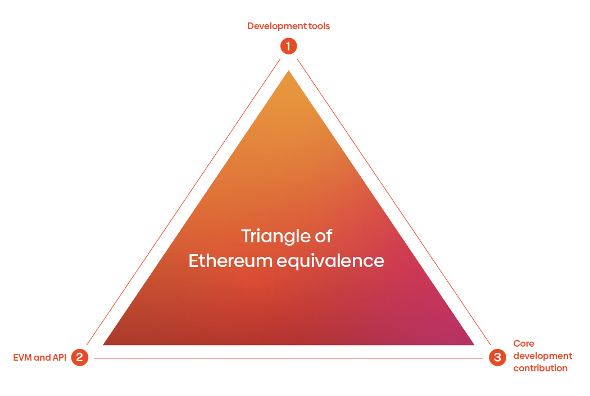

# 이더리움 호환성

## We Support Ethereum Equivalence

### 1. Development Tools 
Any tooling that can run on Ethereum will run seamlessly within the Klaytn ecosystem by making Klaytn’s technical stack equivalent, from an interfacing and execution perspective, to the existing Ethereum stack. New tooling created in the Klaytn ecosystem could be reciprocally adopted within the Ethereum ecosystem.

### 2. EVM and API 
By building on top of existing Ethereum stacks; we inherit any improvements made to the open-source codebases of EVM and supporting libraries. Supporting such equivalent opcodes and stack logic in the Klaytn EVM environment would see execution behaviour is guaranteed equivalent; and supporting a set of JSON-RPC APIs with equivalent endpoint payload syntax guarantees full Ethereum interfacing equivalence.

### 3. Core Development Contribution 
Supporting Ethereum equivalence translates most to the mutual benefit to both the Klaytn and Ethereum ecosystems. 대부분의 이더리움 개선 제안(EIP)은 클레이튼 코어 개발 어젠다에 이전, 적용될 수 있을 것이며 클레이튼 개선 제안(KIP) 또한 이더리움과 EVM의 발전에 기여할 수 있을 것입니다. When the development community contributes to one ecosystem, they are indeed contributing to both.
