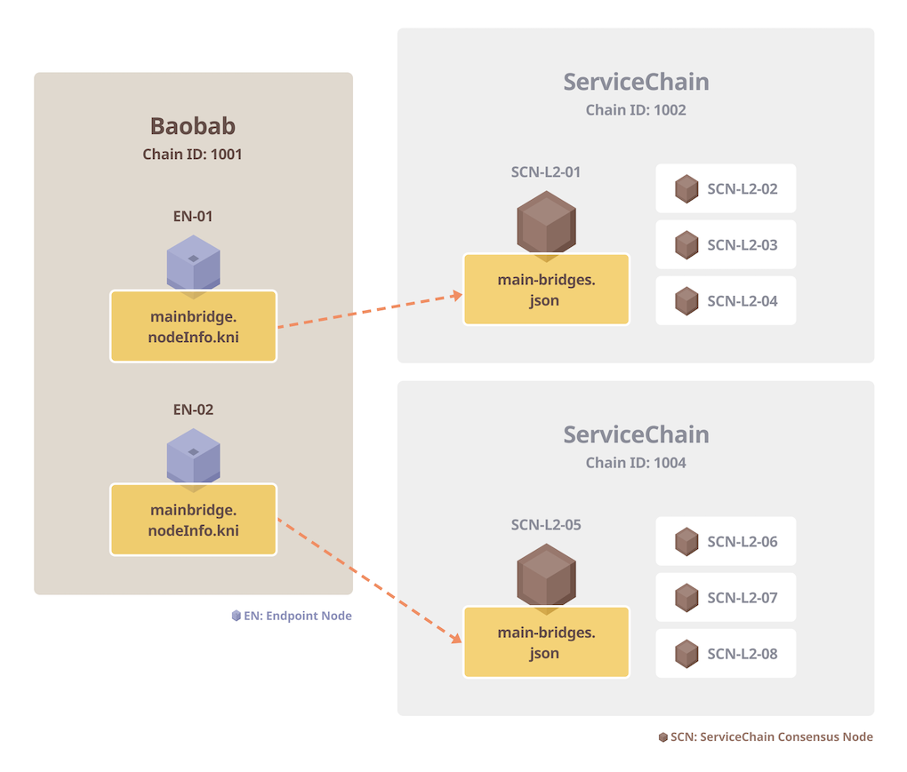
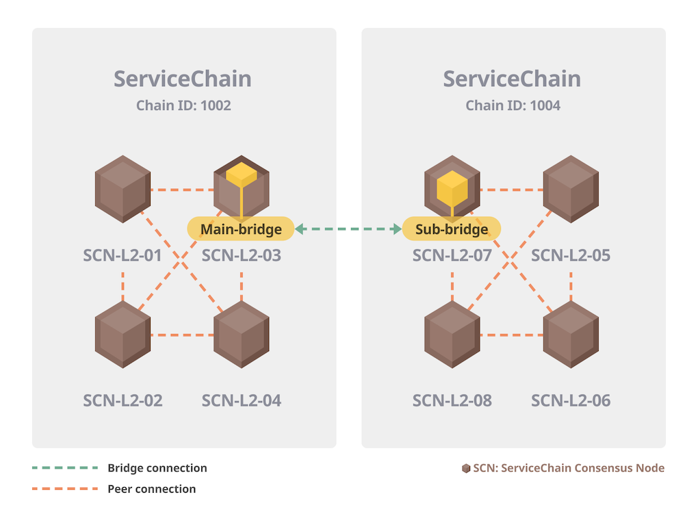

이번 장에서는 서비스체인 네트워크 사이에 토큰 전송이 가능하도록 구성하는 방법을 설명합니다. 서비스체인에서 제공하는 주요 기능인 데이터 앵커링 및 토큰 전송은 서로 독립적으로 사용할 수 있습니다.  즉, 두 가지 기능을 모두 사용하지 않고, 데이터 앵커링만 사용하거나 토큰 전송만 사용할 수 있습니다.

아래 그림과 같이 Baobab에 연결된 두 개의 서비스체인(chainID 1002, 1004)이 있는 경우 각 서비스체인은 Baobab으로 데이터 앵커링을 수행하므로 두 서비스체인 간에 데이터 앵커링이 꼭 필요한 상황이 아니라면, 토큰 전송만 사용할 수 있니다.

두 서비스체인 사이에 브릿지가 없을 때 토큰 전송을 하려면, 먼저 한 서비스체인(chainID 1002)에서 Baobab(chainID 1001)로 토큰을 전송한 다음 Baobab(chainID 1001)에서 다른 서비스체인(chainID 1004)으로 토큰을 다시 전송해야 합니다.  이는 서비스체인(chainID 1002)에서 다른 서비스체인(chainID 1004)으로 한 번에 직접 가치 전달을 제공하는 것보다 비효율적입니다. 따라서 서비스체인 사이에 브릿지를 만들어 다른 서비스체인으로 직접 토큰 전송한다면 Baobab을 거치는 방법보다 효율적인 토큰 전송이 가능해 집니다.



## 준비 사항 <a id="prerequisites"></a>
- 두 개의 서비스체인을 구성하고 각 서비스체인은 Baobab EN에 연결되어 있다고 가정합니다.  [Connecting to Baobab](en-scn-connection.md)를 참조하세요.
- 또한 [Cross-Chain Value Transfer](value-transfer.md)를 통해 토큰 전송을 성공적으로 실행한 것을 가정합니다.

아래 그림과 같이 Baobab에 연결된 서비스체인(chianID 1004)을 추가로 설치합니다.

각 네트워크의 노드에 메인 브릿지와 서브 브릿지를 설치합니다.  이번 예제에서는 SCN-L2-03 노드와 SCN-L2-07 노드에 각각 메인 브릿지와 서브 브릿지를 설치하려고 합니다.



## 1단계 : SCN-L2-03 노드의 KNI 설치<a id="step-1-check-kni-of-scn-node"></a>
SCN-L2-07 노드에서 서브 브릿지를 설정하기 위해 필요한 정보인 SCN-L2-03의 KNI를 잘 기억해 둡니다. 이 정보 `main-bridges.json` 파일을 생성하는 다음 단계에서 사용됩니다.

```
SCN-L2-03$ kscn attach --datadir ~/data
> mainbridge.nodeInfo.kni
"kni://...39047242eb86278689...@[::]:50505?discport=0"
```

## 2단계 : main-bridges.json 생성<a id="step-2-create-main-bridges-json"></a>
SCN-L2-07 (주의: chianID 1004) 쉘에 접속하여 `~/data`에 `main-bridges.json` 파일을 만듭니다.  `@` 문자 뒤에 있는 `[::]`에 SCN-L2-03 노드의 IP 주소를 적습니다.
```
$ echo '["kni://...39047242eb86278689...@192.168.0.3:50505?discport=0"]' > ~/data/main-bridges.json
```

## 3단계 : SCN 설정 후 재시작<a id="step-3-configure-scn-then-restart"></a>
SCN-L2-07 노드의 셸에서 `kscn-XXXXX-amd64/conf/kscnd.conf`를 편집합니다.  두 서비스체인은 이미 Baobab EN에 각각 앵커링되어 있으므로 서비츠체인 사이에 데이터 앵커링은 필요하지 않다고 가정합니다.  그래서 `SC_ANCHORING`을 0으로 설정했습니다.

```
...
SC_SUB_BRIDGE=1
...
SC_PARENT_CHAIN_ID=1002
...
SC_ANCHORING=0
...
```

SCN-L2-07 노드의 kscnd를 재시작합니다.
```
SCN-L2-07$ kscnd stop
Shutting down kscnd: Killed
SCN-L2-07$ kscnd start
Starting kscnd: OK
```

`subbridge.peers.length`을 조회하여 SCN-L2-07과 SCN-L2-03이 연결되어 있는지 확인하십시오.
```
SCN-L2-07$ kscn attach --datadir ~/data
> subbridge.peers.length
1
```

토큰 전송의 경우, chainID 1002인 서비스체인을 메인 브릿지가 있는 네트워크로, chainID 1004인 서비스체인을 서브브릿지가 있는 네트워크로 보면, [Cross-Chain Value Transfer](./value-transfer.md)에서 설명한 것처럼 토큰 전송이 가능하다.
