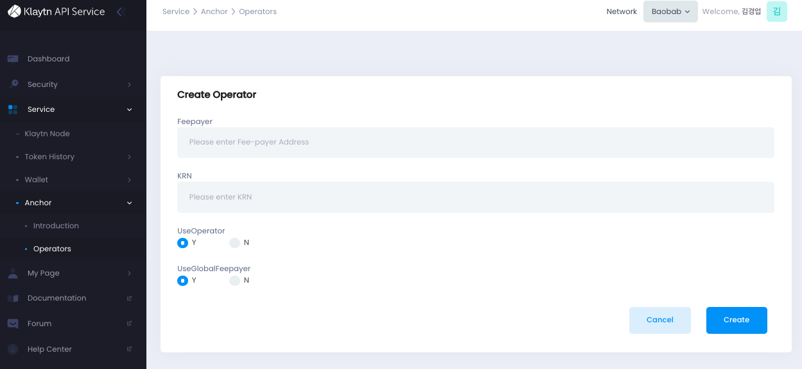

Design에서 설명했듯이, 클레이튼 메인체인에 서비스 체인 데이터를 앵커링할 수 있습니다. 이 페이지는 [KAS (Klaytn API Service)](https://www.klaytnapi.com)를 통해 데이터 앵커링을 활성화하는 법을 소개합니다.

서비스 체인의 노드가 활성화되면 주기적으로 그 체인 데이터(블록 데이터)를 Cypress나 Baobab에 앵커링함으로써 서비스체인의 존재와 불가역성을 증명할 수 있습니다. 이는 서비스체인의 보안과 신뢰성을 보장합니다.

# KAS 사용 준비하기<a id="preparation-with-kas"></a>
이 장은 데이터 앵커링을 위해 KAS를 사용하기 위한 필요조건들을 소개합니다.

## Sign Up KAS (Klaytn API Service) <a id="sign-up-kas"></a>
우선 [KAS 콘솔](https://www.klaytnapi.com)에서 KAS에 가입을 해서 KAS 계정을 생성해야 합니다. KAS 웹사이트를 방문하여 가입을 합니다.

[](https://www.klaytnapi.com)

[](https://www.klaytnapi.com)

## 자격증명 생성하기<a id="check-credential"></a>
로그인 후 아래와 같이 자격증명을 생성할 수 있습니다. `AccessKey ID`와 `Secret AccessKey` 또는 `Authorization`를 사용해 KAS APIs를 호출할 것입니다.


## Anchor API<a id="anchor-api"></a>
앵커링을 하기 위해서 KAS가 데이터 앵커링을 위해 제공하는 Anchor API를 사용하게 될 것입니다.


## 운영자 주소 생성하기<a id="create-kas-credential"></a>
KAS를 통해 서비스 체인 데이터를 앵커링 하기 위해서는 KAS에 등록이 된 클레이튼 주소가 있어야 하며, 이 주소가 클레이튼에 앵커링 트랜잭션을 보내게 될 주소입니다. 서비스 노드를 셋업하기 전에, KAS를 통해 "operator"라는 클레이튼 계정을 생성해야 합니다. KAS 콘솔을 이용해 이 계정을 만들어 주세요.

It is important to be noticed that you must **first select the chain** in Klaytn to which you want to anchor your data on **the top right corner of the KAS console page**. You should create an operator for each chain (Cypress/Baobab).


Create an operator as below.



Then, you can check your operator list like below. Please note that the address of an operator is required for setting your service chain node.


## Configure Service Chain Node <a id="configure-service-chain-node"></a>
After obtaining API credentials, Anchor API information (API endpoint and parameters), and an operator account in KAS, then It is time to set up your service chain node. You need to edit the configuration file (`kscnd.conf`, `kspnd.conf`, `ksend.conf`) of your service chain node like below.

You should set `SC_SUB_BRIDGE=1` and all `SC_KAS_` prefix items.

```bash
...
# service chain options setting
...
SC_SUB_BRIDGE=1
...

SC_KAS_ANCHOR=1                                                         # 1: enable, 0: disable
SC_KAS_ANCHOR_PERIOD=10                                                 # Anchoring block period
SC_KAS_ANCHOR_URL="https://anchor-api.klaytn.com/v1/anchor"             # Anchor API URL
SC_KAS_ANCHOR_OPERATOR="0x6A3D565C4a2a4cd0Fb3df8EDfb63a151717EA1D7"     # Operator address
SC_KAS_ANCHOR_ACCESS_KEY="KAJM4BEIR9SKJKAW1G3TT8GX"                     # Credential Access key
SC_KAS_ANCHOR_SECRET_KEY="KyD5w9ZlZQ7ejj6lDF6elb61u8JH/mXdKqhgr3yF"     # Credential Secret key
SC_KAS_ANCHOR_X_CHAIN_ID=1001                                           # Cypress: 8217, Baobab: 1001
...
```

## Run Service Chain Node <a id="run-service-chain-node"></a>
Now you are good to go. You can run your service chain node. You will see the log message related with KAS Anchor API like below.

```bash
...
INFO[09/10,18:09:28 +09] [5] Imported new chain segment                number=86495 hash=5a20d6…cbca1b blocks=1  txs=3 elapsed=2.387ms  trieDBSize=5.10kB mgas=0.063 mgasps=26.383
INFO[09/10,18:09:28 +09] [53] Anchored a block via KAS                  blkNum=86495
INFO[09/10,18:09:29 +09] [5] Imported new chain segment                number=86496 hash=8897bc…4ea7e7 blocks=1  txs=3 elapsed=2.158ms  trieDBSize=5.10kB mgas=0.063 mgasps=29.188
INFO[09/10,18:09:29 +09] [53] Anchored a block via KAS                  blkNum=86496
INFO[09/10,18:09:30 +09] [5] Imported new chain segment                number=86497 hash=44b319…7d4247 blocks=1  txs=3 elapsed=2.346ms  trieDBSize=5.43kB mgas=0.063 mgasps=26.848
INFO[09/10,18:09:30 +09] [53] Anchored a block via KAS                  blkNum=86497
INFO[09/10,18:09:31 +09] [5] Imported new chain segment                number=86498 hash=0b98ba…73d654 blocks=1  txs=3 elapsed=2.235ms  trieDBSize=5.61kB mgas=0.063 mgasps=28.186
INFO[09/10,18:09:31 +09] [53] Anchored a block via KAS                  blkNum=86498
INFO[09/10,18:09:32 +09] [5] Imported new chain segment                number=86499 hash=4f01ab…3bc334 blocks=1  txs=3 elapsed=3.319ms  trieDBSize=5.61kB mgas=0.063 mgasps=18.977
INFO[09/10,18:09:32 +09] [53] Anchored a block via KAS                  blkNum=86499
...
```

## List of Transaction <a id="list-of-transaction"></a>
In KAS console website, you can see the list of anchoring transactions that the operator of your service chain has sent at "KAS Console - Service - Anchor - Operators" menu like below.


