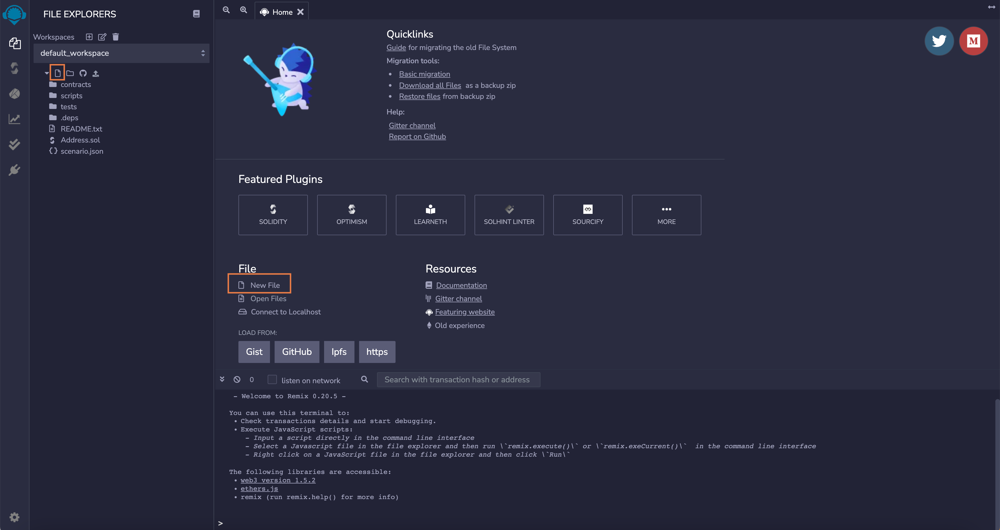
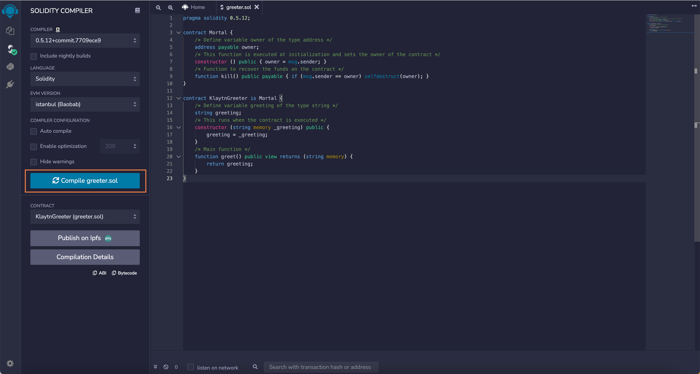
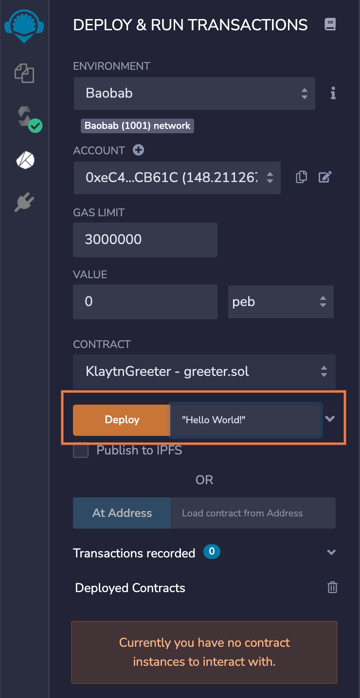
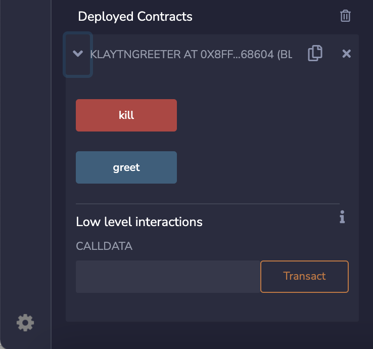

# 배포 가이드 <a id="deploy-guide"></a>

클레이튼에 스마트 컨트랙트를 배포하는 방법에는 여러 가지가 있습니다. 이 문서는 다양한 도구를 사용하여 샘플 컨트랙트를 배포하기 위한 단계별 가이드를 제공합니다. 트랜잭션 수수료를 지불하기에 충분한 KLAY가 있는 Klaytn 계정이 있다고 가정합니다. 계정을 만들려면 [Klaytn Wallet](../toolkit/klaytn-wallet.md)을 참조하세요.

## Klaytn IDE <a id="klaytn-ide"></a>

Open your internet browser and go to https://ide.klaytn.foundation


- 새 파일을 추가하세요.




- 다음 코드(또는 배포하고자 하는 아무 코드)를 복사해 붙여넣습니다. 이 코드는 Mortal과 KlaytnGreeter라는 두 컨트랙트로, 간단히 "Hello World!"를 실행할 수 있습니다.

```
pragma solidity 0.5.12;

contract Mortal {
    /* Define variable owner of the type address */
    address payable owner;
    /* This function is executed at initialization and sets the owner of the contract */
    constructor () public { owner = msg.sender; }
    /* Function to recover the funds on the contract */
    function kill() public payable { if (msg.sender == owner) selfdestruct(owner); }
}

contract KlaytnGreeter is Mortal {
    /* Define variable greeting of the type string */
    string greeting;
    /* This runs when the contract is executed */
    constructor (string memory _greeting) public {
        greeting = _greeting;
    }
    /* Main function */
    function greet() public view returns (string memory) {
        return greeting;
    }
}
```

- 아이콘 패널에서 Compiler를 선택해주세요. 그리고 원하는 EVM 환경을 선택합니다. 클레이튼 네트워크의 경우 Baobab(테스트넷)과 Cypress(메인넷) 사이에서 선택할 수 있습니다. Click `Compile` when the sample code is ready to be complied before actual deployment.



- 이제 컨트랙트를 배포할 수 있습니다. 아이콘 패널에서 클레이튼 로고를 선택해주세요. `Account` 옆의 더하기 버튼을 눌러 계정을 가져올 수 있습니다. Make sure that the account has sufficient KLAY to pay for the transaction of deploying the smart contracts required.


- 보낼 가스 한도 및 값을 설정하세요.
  - 보다 복잡한 컨트랙트를 배포하는 경우 가스 한도를 더 높게 설정해야 할 수 있습니다. 이 예시에서는 그대로 두어도 됩니다.
  - 배포 시 컨트랙트에 `KLAY`를 보내고 싶지 않다면 `값(Value)`을 0으로 설정하세요.
- "Hello World!"를 생성자 함수의 인자로 입력하고 `배포(Deploy)` 버튼을 클릭하세요.



- 컨트랙트가 성공적으로 배포되었다면 터미널에 상응하는 트랜잭션 receipt와 자세한 결과값을 볼 수 있습니다.

- 함수 버튼을 클릭하여 컨트랙트와 상호작용할 수 있습니다. 함수들은 다양한 색으로 표시됩니다. 솔리디티의 `constant` 또는 `pure` 함수는 파란색 버튼으로 표시되며(예시에서 `greet`), 새로운 트랜잭션을 생성하지 않기 때문에 가스비가 들지 않습니다. 빨간색 버튼(예시에서 `kill`)은 `payable` 함수로서, 블록체인의 상태를 변경하고 가스를 소진하며 KLAY를 받을 수 있습니다.  오렌지 버튼은 컨트랙트 상태를 변경시키지만 KLAY를 받을 수는 없는 `non-payable` 함수를 나타냅니다.



자세한 내용은 [링크](../toolkit/klaytn-ide.md)를 참고해주세요.

## Truffle  <a id="truffle"></a>

트러플은 스마트 컨트랙트 배포 및 실행에 가장 널리 사용되는 프레임워크입니다.

- 다음 명령을 통해 설치하세요.

```
$ sudo npm install -g truffle
```

- 프로젝트 디렉토리를 설정하고, `truffle-hdwallet-provider-klaytn`를 설치하세요.

```
$ mkdir hello-klaytn
$ cd hello-klaytn
$ truffle init
$ npm install truffle-hdwallet-provider-klaytn
```

- `/contracts` 디렉토리 하에 `KlaytnGreeter.sol`를 생성하고 다음 코드를 복사합니다.

```
pragma solidity 0.5.6;
contract Mortal {
    /* 주소 타입의 소유자(owner) 변수 정의 */
    address payable owner;
    /* 이 함수는 초기화 시점에 실행되어 컨트랙트 소유자를 설정합니다 */
    constructor () public { owner = msg.sender; }
    /* 컨트랙트에서 자금을 회수하는 함수 */
    function kill() public payable { if (msg.sender == owner) selfdestruct(owner); }
}

contract KlaytnGreeter is Mortal {
    /* 문자열 타입의 변수 greeting 정의 */
    string greeting;
    /* 이 함수는 컨트랙트가 실행될 때 작동합니다 */
    constructor (string memory _greeting) public {
        greeting = _greeting;
    }
    /* 주(Main) 함수 */
    function greet() public view returns (string memory) {
        return greeting;
    }
}
```

- `/migrations/1_initial_migration.js`를 다음과 같이 수정합니다.

```
const Migrations = artifacts.require("./Migrations.sol");
const KlaytnGreeter = artifacts.require("./KlaytnGreeter.sol");
module.exports = function(deployer) {
  deployer.deploy(Migrations);
  deployer.deploy(KlaytnGreeter, 'Hello, Klaytn');
};
```

- 아래와 같이 `truffle-config.js`를 설정하세요. 컨트랙트를 배포할 충분한 `KLAY`를 가진 계정의 개인키를 입력하세요.

```
const HDWalletProvider = require("truffle-hdwallet-provider-klaytn");

const privateKey = "0x3de..." 
 
XPath: /pre[6]/code
```
*참고*: 이 예제는 상업용으로 권장되지 않습니다. 개인키를 다룰 때 많은 주의를 기울이세요.

- Klaytn 테스트넷에 배포.

```
$ truffle deploy --network testnet
```

- Klaytn 메인넷에 배포.

```
$ truffle deploy --network mainnet
```

자세한 내용은 이 [링크](../toolkit/truffle.md)를 참조하세요.

## VVISP<a id="vvisp"></a>
vvisp은 스마트 컨트랙트 개발을 위해 HEACHI LABS에서 제공하는 사용하기 쉬운 cli 도구/프레임워크입니다. 단일 명령만으로 환경을 쉽게 설정하고, Klaytn 스마트 컨트랙트를 배포 및 실행할 수 있습니다. 자세한 내용을 위해 다음 링크를 참조하세요.
- https://henesis.gitbook.io/vvisp/deploying-smart-contracts

## solc & caver-js <a id="solc-caver-js"></a>

컨트랙트를 배포하는 또 다른 방법은 solc로 컨트랙트를 수동으로 컴파일하고 caver-js로 컨트랙트를 배포하는 것입니다.

- `KlaytnGreeter.sol`를 생성하고 다음 코드를 작성하세요.

```
pragma solidity 0.5.6;
contract Mortal {
    /* 주소 타입의 소유자(owner) 변수 정의 */
    address payable owner;
    /* 이 함수는 초기화 시점에 실행되어 컨트랙트 소유자를 설정합니다 */
    constructor () public { owner = msg.sender; }
    /* 컨트랙트에서 자금을 회수하는 함수 */
    function kill() public payable { if (msg.sender == owner) selfdestruct(owner); }
}

contract KlaytnGreeter is Mortal {
    /* 문자열 타입의 변수 greeting 정의 */
    string greeting;
    /* 이 함수는 컨트랙트가 실행될 때 작동합니다 */
    constructor (string memory _greeting) public {
        greeting = _greeting;
    }
    /* 주(Main) 함수 */
    function greet() public view returns (string memory) {
        return greeting;
    }
}
```

- solc 0.5.6을 설치하세요.

```
$ sudo npm install -g solc@0.5.6
```

- 컨트랙트를 컴파일하세요.

```
$ solcjs KlaytnGreeter.sol --bin
```

- caver-js를 설치하세요.

```
$ npm install caver-js.
```

- 같은 디렉토리에 다음 코드의 `deploy.js`를 생성하세요.

```
const Caver = require("caver-js");
const caver = new Caver("https://api.baobab.klaytn.net:8651")

const walletInstance = caver.klay.accounts.privateKeyToAccount(
  '0x3de0c9...' // enter your private key to deploy contract with
);
caver.klay.accounts.wallet.add(walletInstance);

const fs = require('fs')
const bytecode = fs.readFileSync('./KlaytnGreeter_sol_KlaytnGreeter.bin') // compiled output

const constructorType = ['string']  // enter appropriate constructor type
const constructorValue = ['Hello, Klaytn!']

const params = caver.klay.abi.encodeParameters(constructorType, constructorValue);

caver.klay.sendTransaction({
  from: caver.klay.accounts.wallet[0].address,
  gas: "50000000",
  data: bytecode.toString() + params.substring(2, params.length)
})
.once("receipt", receipt => {
  console.log(receipt)
})
.once("error", error => {
  console.log(error);
})
```
*참고*: 이 예제는 상업용으로 권장되지 않습니다. 개인키를 다룰 때 많은 주의를 기울이세요.

- node 환경을 사용해 컨트랙트를 배포하세요.

```
$ node deploy.js
```

