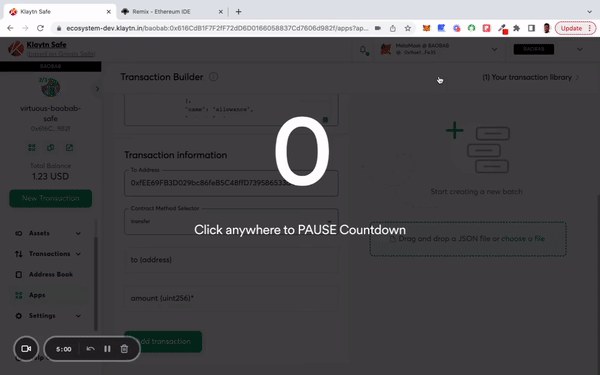
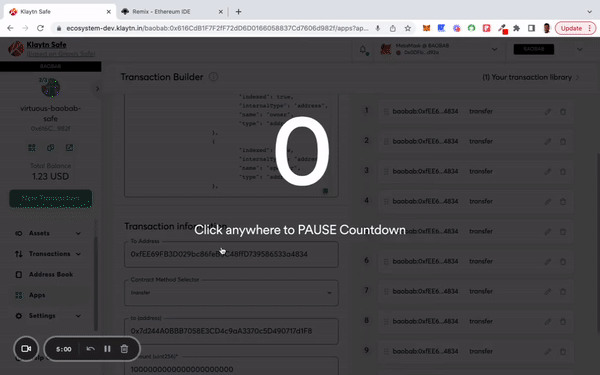

## 트랜잭션 빌더

트랜잭션 빌더는 트랜잭션 배치화를 위한 Klaytn Safe 내의 커스텀 앱입니다.  배치화라는 것은 여러 개의 트랜잭션을 하나하나 검증하는 대신 하나로 모을 수 있다는 것입니다. 단 한번만 검증하고 실행하면 됩니다.

트랜잭션 빌더를 사용하면 토큰 전송이나 복잡한 컨트랙트 사용까지 트랜잭션들을 생성하여 하나의 트랜잭션으로 배치화할 수 있습니다.

**예시**

Let's say you want to airdrop tokens to a long list of addresses, say 100 DRIP tokens to 10 addresses. Instead of having to create 10 transactions, which the owners of your safe have to confirm and execute one after the other, the transaction builder puts all these transfers into a single transaction.

In this guide, we have minted DRIP tokens to the Safe address for illustrative purpose.

Let’s get started with this example using Transaction Builder!

**Step 1:** Open Safe Apps.

**Step 2:** Open the Transaction Builder Safe app

**Step 3:** Enter your token contract address and ABI. In this example, DRIP contract address and ABI will be used. You can copy and paste your ABI into the “Enter ABI” field.

**Step 4:** Select a method and fill the transaction information

From the drop-down you can select a method. In this case, we select the **transfer** method. For this step to be completed, you have to fill out the transaction information, such as **to(address)** and **amount(uint256)**.

Note: The value is an unsigned integer without any decimals. In this example, the DRIP token has 18 decimals. So if you want to send 1 DRIP, you have to enter 1000000000000000000.

**Step 5:** Click **Add transaction**

**Step 6:** Repeat steps **4**, **5**, and **6** for every recipient address.

**Step 7:** Once you added all operations to the batch click **Create Batch**

**Step 8:** Review and submit transaction

You'll be able to review the whole batch. Once ready, click **Send Batch** to submit and execute the transaction just like any other Safe transaction.

